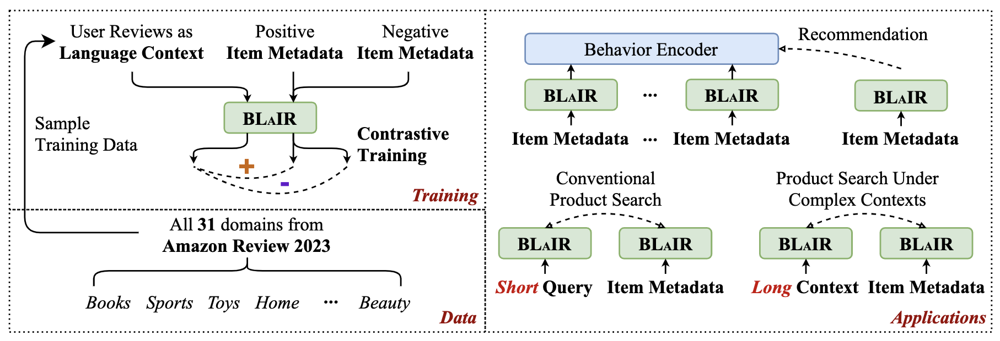
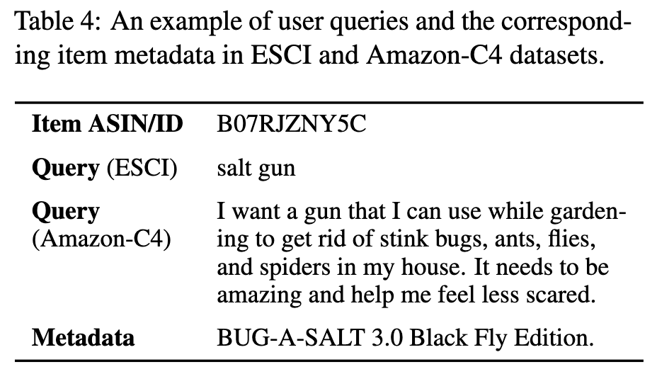

# Amazon Reviews 2023

[[🌐 Website](https://amazon-reviews-2023.github.io/)] · [[🤗 Huggingface Datasets](https://huggingface.co/datasets/McAuley-Lab/Amazon-Reviews-2023)] · [[📑 Paper](https://arxiv.org/abs/2403.03952)] · [[🔬 McAuley Lab](https://cseweb.ucsd.edu/~jmcauley/)]

---

This repository contains:
* Scripts for processing [Amazon Reviews 2023](https://amazon-reviews-2023.github.io/) dataset into recommendation benchmarks;
* Checkpoints & implementations for BLaIR: "[Bridging Language and Items for Retrieval and Recommendation](https://arxiv.org/abs/2403.03952)";
* Scripts for constructing Amazon-C4, a new dataset for evaluating product search performance under complex contexts.

## Recommendation Benchmarks

Based on the released Amazon Reviews 2023 dataset, we provide scripts to preprocess raw data into standard train/validation/test splits to encourage benchmarking recommendation models.

**More details here ->** [[datasets & processing scripts]](benchmark_scripts/README.md)

## BLaIR

BLaIR, which is short for "**B**ridging **La**nguage and **I**tems for **R**etrieval and **R**ecommendation", is a series of language models pre-trained on Amazon Reviews 2023 dataset.

<center>
    
</center>

BLaIR is grounded on pairs of *(item metadata, language context)*, enabling the models to:
* derive strong item text representations, for both recommendation and retrieval;
* predict the most relevant item given simple / complex language context.

**More details here ->** [[checkpoints & code]](blair/README.md)

## Amazon-C4

Amazon-C4, which is short for "**C**omplex **C**ontexts **C**reated by **C**hatGPT", is a new dataset for the **complex product search** task.

<center>
    
</center>

Amazon-C4 is designed to assess a model's ability to comprehend complex language contexts and retrieve relevant items.

**More details here ->** [[datasets & code]](amazon-c4/README.md)

## Reproduction

* Please refer to [seq_rec_results](seq_rec_results/README.md) for scripts that can reproduce our results on sequential recommendation.
* Please refer to [product_search_results](product_search_results/README.md) for scripts that can reproduce our results on product search.

## Contact

Please let us know if you encounter a bug or have any suggestions/questions by [filling an issue](https://github.com/hyp1231/AmazonReview2023/issues/new) or emailing Yupeng Hou ([@hyp1231](https://github.com/hyp1231)) at [yphou@ucsd.edu](mailto:yphou@ucsd.edu).

## Acknowledgement

If you find Amazon Reviews 2023 dataset, BLaIR checkpoints, Amazon-C4 dataset, or our scripts/code helpful, please cite the following paper.

```bibtex
@article{hou2024bridging,
  title={Bridging Language and Items for Retrieval and Recommendation},
  author={Hou, Yupeng and Li, Jiacheng and He, Zhankui and Yan, An and Chen, Xiusi and McAuley, Julian},
  journal={arXiv preprint arXiv:2403.03952},
  year={2024}
}
```

The recommendation experiments in the BLaIR paper are implemented using the open-source recommendation library [RecBole](https://github.com/RUCAIBox/RecBole).

The pre-training scripts refer a lot to [huggingface language-modeling examples](https://github.com/huggingface/transformers/tree/main/examples/pytorch/language-modeling) and [SimCSE](https://github.com/princeton-nlp/SimCSE).
